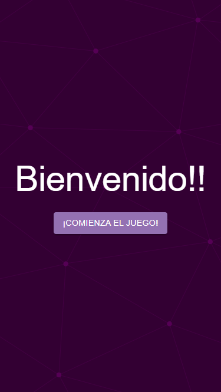
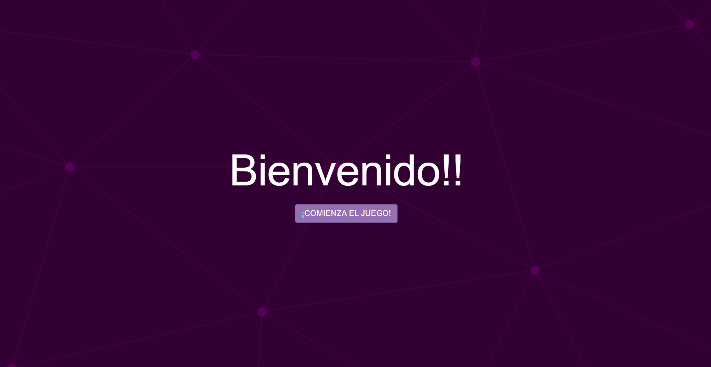
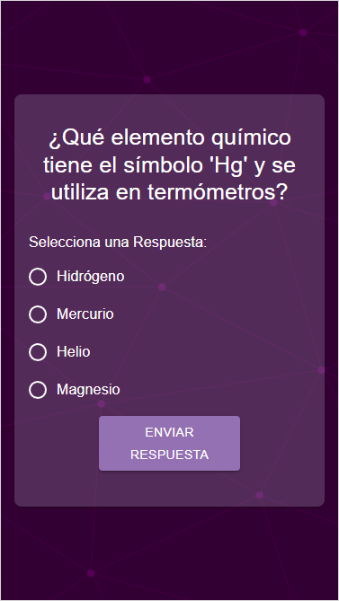
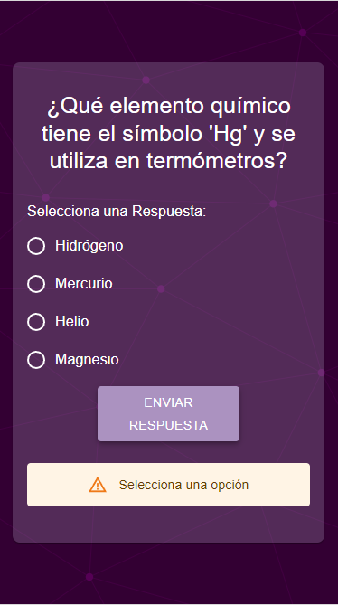
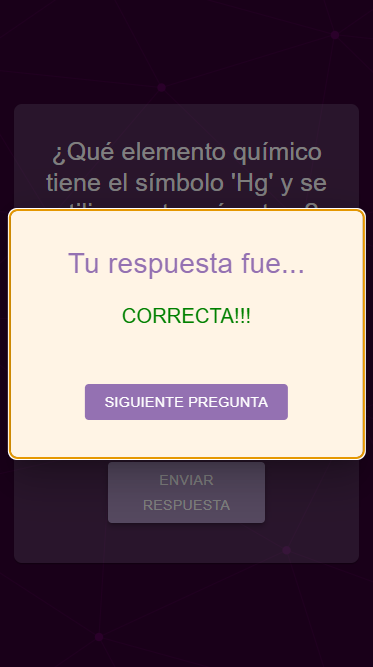
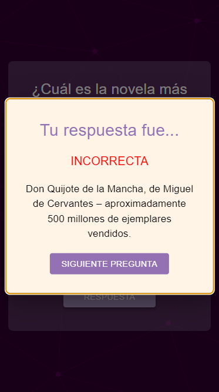
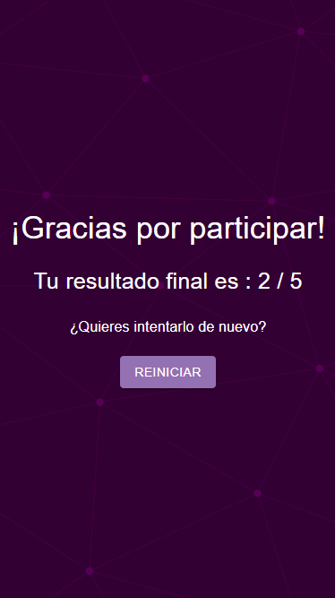

## Consigna:

_Ana es una maestra que quiere ayudar a sus estudiantes a aprender más sobre cultura general de una manera divertida y original. Para ello, necesita una herramienta que permita a los estudiantes responder a preguntas de trivia y ver sus resultados en tiempo real. Podremos ayudar a Ana a lograr que sus estudiantes se interesen en su materia?_

## Requisitos:

### Pantalla de Inicio:

- Una pantalla inicial con un botón para empezar el juego.

### Preguntas de Trivia:

- Mostrar una pregunta a la vez con cuatro opciones de respuesta.
- Permitir al usuario seleccionar una respuesta.
- Mostrar feedback inmediato sobre si la respuesta es correcta o incorrecta.
- Pasar a la siguiente pregunta después de mostrar el feedback.

### Puntuación Final:

- Mostrar la puntuación total obtenida al final del juego.

## Pistas:

- Utilizar useState para manejar el estado del juego, incluyendo las preguntas, la pregunta actual, las respuestas del usuario y la puntuación.
- Usar react-hook-form para manejar la selección de respuestas (aunque para este caso simple, puede manejarse con useState).
- Aprovechar los componentes de MaterialUI como Button, Typography, Radio, RadioGroup, FormControl, FormControlLabel, y Card para la UI.
- En el repositorio ya encontrarán un archivo js con algunas preguntas cargadas. Pueden modificar la estructura de la información a su gusto para realizar la funcinoalidad.

Buena suerte! 💖 

# Solución:

# Trivia

Esta app [Triva]() es un juego de preguntas donde el usuario por cada pregunta correcta suma un punto.

## La vista segun el tamaño:

Modo celular:

Modo desktop:

## Modo de uso:

- Una pantalla inicial para empezar, allí se ve un botón de comienza el juego al tocarlo lleva al usuario a la primera pregunta de la trivia.

- Muestra una pregunta a la vez con cuatro opciones de respuesta.
- Permite al usuario seleccionar una respuesta.
- Si se oprime el botón de enviar respuesta sin haber seleccionado una, saldrá el aviso de "seleciona una opción".

- Mustra feedback inmediato sobre si la respuesta es correcta:

o incorrecta:

Si la respuesta es incorrecta saldrá una breve descripción de lo correcto.

- Pasa a la próxima pregunta después de mostrar el feedback y presionar "siguiente pregunta".

### Puntuación Final:

Mustra la puntuación total obtenida al final del juego.

- Además permite volver a intentarlo si así se desea.

## Construido Con:

Las tecnologías que se utilizaron para construir este proyecto:

- JavaScript
- React
- Material-UI (MUI)

## Link al deploy
